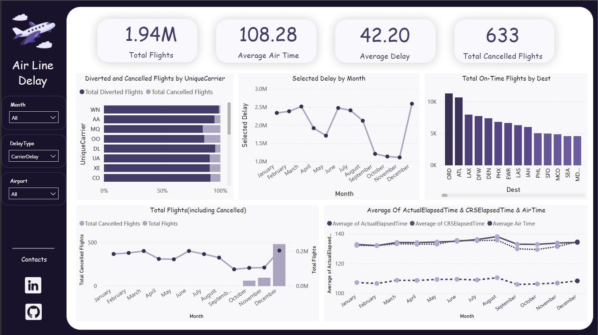

Airline Delay Analysis Dashboard
This Power BI dashboard provides a comprehensive analysis of airline delays. The dataset contains detailed information about flight delays in the United States, covering various aspects such as the number of flights, delay causes, and cancellation statistics.

Key Features:
Total Flights Overview:

Displays the total number of flights (1.94M) along with key metrics such as average air time (108.28 minutes), average delay (42.20 minutes), and total canceled flights (633).
Diverted and Cancelled Flights by Unique Carrier:

This bar chart visualizes the percentage of total diverted and canceled flights across different airlines, allowing users to quickly identify carriers with the highest disruptions.
Selected Delay by Month:

A line chart showing the monthly trend of selected delays, offering insights into how delays fluctuate throughout the year.
Total On-Time Flights by Destination:

This bar chart ranks destinations based on the number of on-time flights, providing a clear picture of which airports are most reliable in terms of punctuality.
Total Flights (Including Canceled):

A combined line and bar chart representing the total number of flights alongside canceled flights, helping users track cancellation trends over time.
Average of Actual Elapsed Time, CRSElapsedTime, and Air Time:

This line chart compares the average of actual elapsed time, scheduled elapsed time, and air time, offering an understanding of how these metrics relate to each other across different months.
Filters:
Month: Allows users to filter the data based on specific months.
Delay Type: Filters data based on the type of delay (e.g., Carrier Delay).
Airport: Filters data for specific airports.
Contacts:
For further information or queries, please reach out via LinkedIn or GitHub, accessible through the links provided in the dashboard.

Dataset:
The dataset used in this project is sourced from Kaggle and can be accessed here.
https://www.kaggle.com/datasets/giovamata/airlinedelaycauses?select=DelayedFlights.csv
